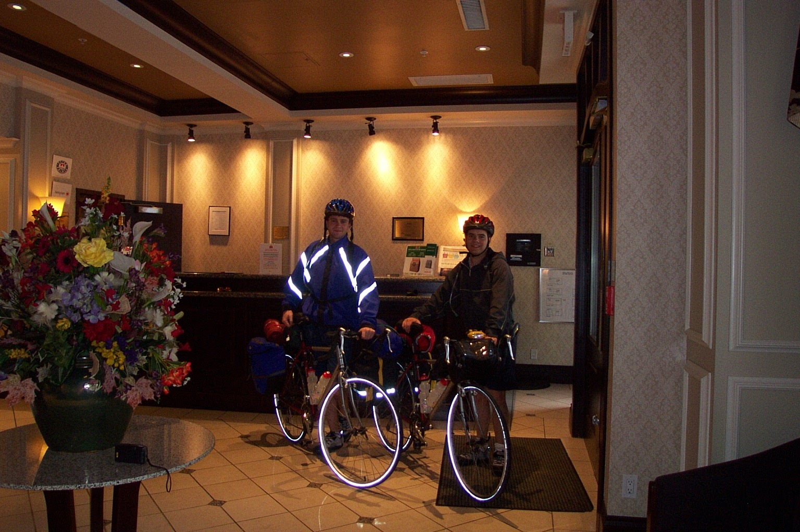
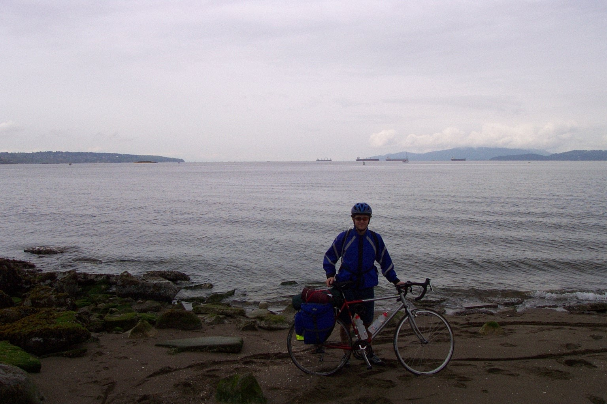

Well we are approximately 12hrs from hopping on the bikes and heading east towards Newfoundland. We have spent the past two days packing, travelling, unpacking and touring, but now I'm ready to start riding. 

Yesterday was a bit hectic with getting everything packed up and ready to go... who would have thought taking a bike apart could be so difficult! It certainly didn't take long for the troubles to start as I stripped the threads on the crank shaft of my bike while trying to remove the pedals. Whatever you do, don't listen when people in bike stores tell you about the "lefty-loosey, righty-tighty" rule of thumb. When removing pedals, stand behind the bike and unscrew the pedals towards the rear. While getting the crank replaced, the people tried to explain how it really made sense and how the pedals had to be unscrewed relative to so and so, but really, it is not logical!

Anyway, once the bikes were packed, we headed to the airport and managed to get all bags/bikes checked in at no charge (although the boxes almost didn't fit on the plane!). The flight was rather uneventful, and we landed in Vancouver only 15 mins late, which was impressive (given my history of flying anyway). Then, we caught a cab to the hotel (after only one failed attempt at guessing the right hotel!). That pretty much sums up the first day since we simply crashed once we saw the big comfy beds.

So, I managed to get to Vancouver with little problem, although I cut myself a total of three times already... wonder what I'll look like once I'm finished this trip!!!

Today was basically a day of touring around Vancouver and picking up last minute equipment and food. We managed to see some nice spots within the city, although we unfortunately spent more time walking through the slums of downtown Vancouver. It was all pretty cool though, and I would certainly like to return sometime to see some of the finer parts of the city.

Now that we have (hopefully) everything that we will need to at least get started, we just need to find a way to jam it all into the saddle bags... not exactly sure it will all fit though... may need to eat the food! I am really looking forward to heading out and getting to see what this country has to offer.

I must admit, I have thought more than once in the past day and a half what in the hell possessed me to go ahead with this journey... then I remember - alcohol! Just kidding (sort of)... I really wanted to do something after finishing school to take a break and see other parts of the world before settling down. I'm too young to start a career! Although, travelling around Europe was my first thought, I was not hesitant at all when Dave suggested this bike trip. I'm sure that I will look back and remember this summer for the rest of my life.

Well I guess that is all for now... I will be sure to keep an updated account of my journey. By the time this is all over, this journal should provide some interesting reading... who knows, maybe I will make a book out of it!!!