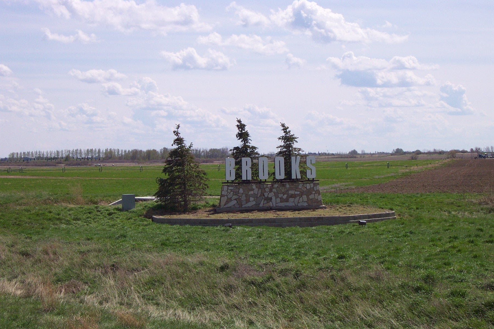
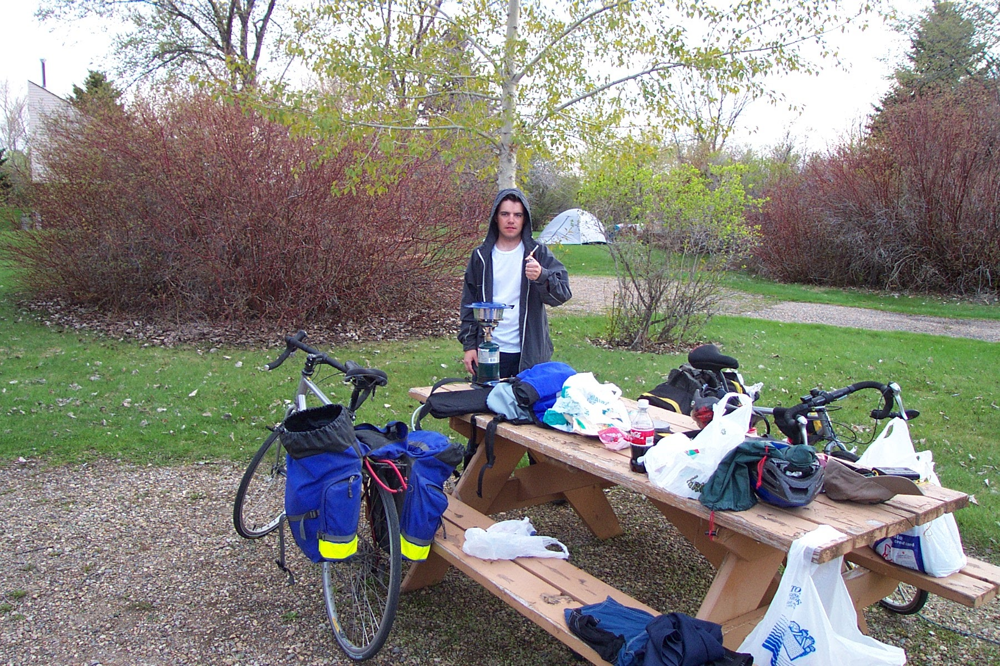

I am happy to report that today was much more successful than yesterday! Dave and I woke up around 7:30am (only 1 hour after our alarm went off), cooked breakfast and packed up all the gear in time to get on the road by 9am. Our suspicion that we could avoid some of the wind by leaving earlier certainly paid off as we had a much easier time heading south than yesterday.

As a result, we reached the Trans Canada Highway relatively early and then started to head east for the first time in a few days. We stopped in Bassano for a quick lunch, and by that time we had covered almost as much ground as we had all of yesterday by about the same time that we had left yesterday!

Following lunch, we set out for Brooks. The biking along the TCH was great as there is a huge shoulder, and it is a divided highway, thus there was little fear of traffic. Aside from a cross wind, the riding today was fairly routine... no flat tires, perfect weather, and great road - not much more we could ask for!

When we reached Brooks we sought out the library to check email and surf the web for a bit. We then picked up a bit of food for the next few days and then got back on the highway to find a place to stay for the night.

We really lucked into the fact that there is a campground just a few kilometres outside Brooks along the highway in the direction of Medicine Hat. The campground is beautiful and very well kept. Also, there are shower and bathroom facilities allowing us to clean up properly for the first time in a couple of days.

All in all, today has been perhaps the first ideal bike trip day - we haven't eaten fast food, the riding was great, and we are camping out for the night. I look forward to many more days like this!