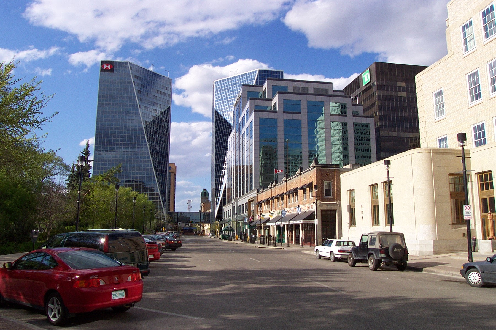

This morning we slowly rolled out of our beds and forced ourselves to go do laundry... mainly because otherwise we would have nothing to wear! We walked for what seemed to be forever to reach the laundromat, and then shelled out $6 to wash two loads of clothes. Once the clothes were all washed and dry, we grabbed a sub and headed back to the room to watch game 4 of the Sens-Devils series.

Following a disheartening loss by the Senators, we headed out to tour the city and run a few errands. The first stop was an an Internet cafe for a double espresso while checking email, sending a few messages and just general net surfing, which I have started to miss.

We then headed to the downtown core for a few pictures and to get cash from our respective banks. We then headed to a local pub for a feast of wings and beer.

Finally, we returned to our room to relax and enjoy the remainder of our rest day. Thus, we are now procrastinating from repacking all of our gear in order to get back on the road tomorrow.

Our next major destination will be Brandon, Manitoba, which is about three days away, and then it's off to Winnipeg where my dad will be waiting with steak and beer! I can't wait!!! I'm really looking forward to seeing dad again, as well as my cousin Paul, and I'm sure that we will have a great time.