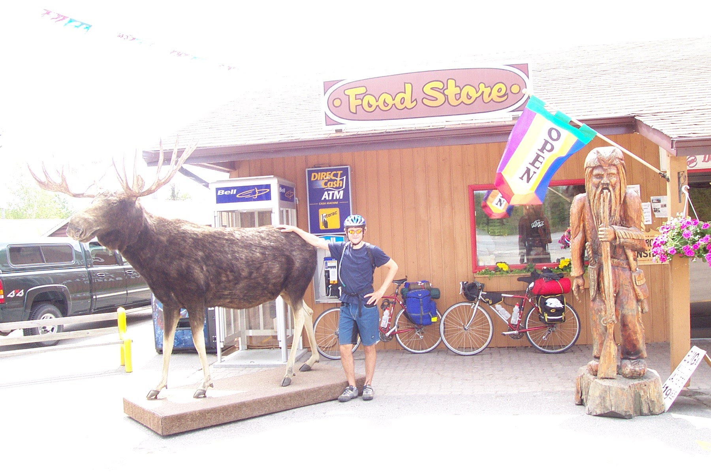
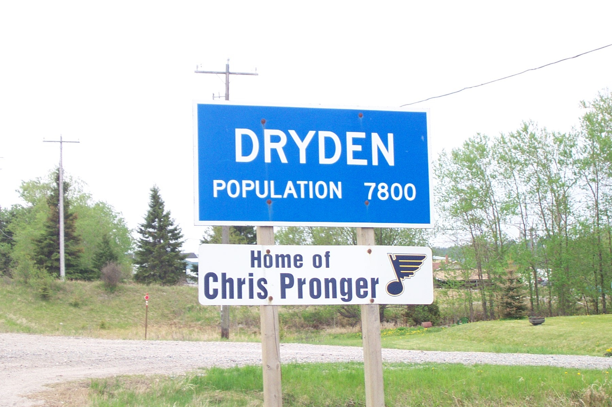

This morning I was very reluctant to get out of bed as the sleeping bag had a firm grip on me. However, once I struggled free from its devious grasp, I was greeted by another beautiful morning. We managed to cook and eat breakfast and pack up all the gear in time to get on the road before 9:30am.

As we continued to weave our way through the winding roads and over the hilly terrain of northern Ontario, we were making much better time than yesterday. I, personally, was feeling much better about about riding in these conditions, and it really made the trip more enjoyable. I had feared yesterday that our progress would be slower than I was hoping, but those thoughts were washed away as we travelled the first 50km in what seemed like no time at all. As a result, we reached Vermillion Bay at around 1pm and stopped for a short snack.

Following lunch, we set out for Dryden which was only another 40km away and was to be our destination for the day. It was interesting that the terrain between Vermillion Bay and Dryden sort of resembled the prairies, but with hills. The road became very straight and fields could be found where there were trees and rocks before.

As we approached Dryden, dark clouds began to dominate the sky, blocking out the sun we have come so accustomed to seeing. All I could think about was getting to a campground and setting the tent up before the skies opened up. The first thing we saw as we entered Dryden was the sign showing the population, and right beneath it was a sign saying "Home of Chris Pronger". Our very first "Home of" town! It definitely warranted a picture.

Next, we set out for a nearby campground as the sky was getting darker and darker. Luckily, there was a spot a few kilometres down the highway, and we quickly registered for the night. Just as we were making our way to the tent area, the rain started falling, so we started to run in order to assemble our tent as soon as possible. We got the tent set up in what seemed to be record time, and just tossed everything inside or under the tarp so that we could keep it as dry as possible. After sitting under a small, covered picnic area for a bit, I hopped in the tent and began arranging everything for the night. Once I was done, Dave hopped in and we simply lay there, waiting out what we hoped would only be a shower.

The rain finally stopped after an hour or so, and we decided to take care of a few necessities before it returned... such as eating. Dave volunteered to make a run to McDonalds while I just sat around and checked out the grounds. When he returned, we headed to the covered picnic area where we met three guys that have been travelling around western Canada looking for work as welders and boilermakers. They have been tenting for almost six weeks and working as they get jobs. It's a pretty interesting way of doing things, but it makes it a convenient lifestyle for tradesman that are on the move a lot. It turns out that they had built the picnic area just two days ago, and I must say, they did a hell of a job!

Anyways, I have now returned to the tent and the pitter-patter of raindrops can once again be heard outside the tent. The forecast is calling for showers and thunderstorms tonight, so I guess it will be a flashback to Moose Jaw. It is supposed to clear off a bit by tomorrow afternoon, but all that I ask for is that it not be raining when I wake up in the morning. If possible, I would like to avoid having to take down the tent in the rain. As for now, I can only hope that the thunderstorms aren't too bad...