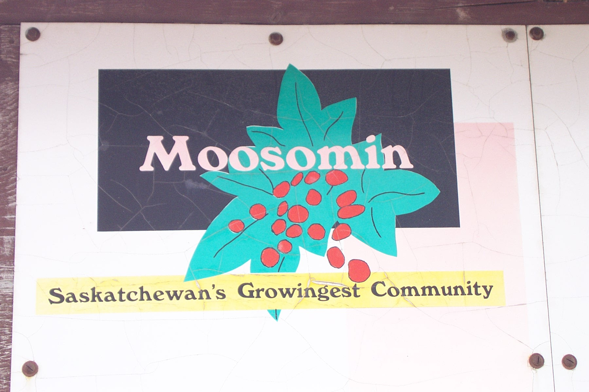
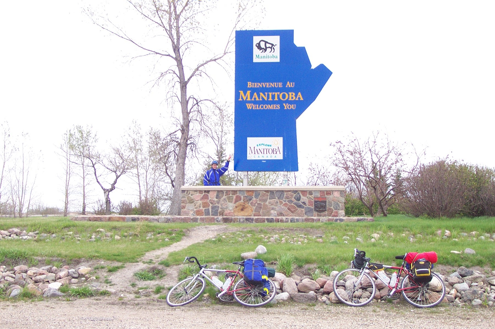

After spending a frosty night in the tent last night, where the mercury fell as low as -2C, Dave and I slowly poked our heads out of our sleeping bags and emerged from the tent. To our amazement, there were little white flakes falling from the sky... SNOW!!! I couldn't believe it!

We quickly cooked a breakfast consisting of the usual oatmeal and beans. Unfortunately, the beans turned out to be lacking heat, thus we were forced to eat cold beans. By the time we got on the road we were already near freezing, and after riding for a few hours my feet were determined to remain ice cubes. By this time we had covered 50km and reached Whitewood. I suggested to Dave that we go for a hot lunch at the Can-Am Truck Stop Restaurant, since the cold beans just didn't cut it! He agreed, and we were finally able to get out of the cold.

After lunch, we were much warmer and refreshed allowing us to continue on for quite some time without much discomfort, thanks in part again to the seemingly ever present tail winds. Our next stop was for a quick snack and bathroom break in Moosomin, "Saskatchewan's Growingest Community".

We then proceeded to the Manitoba border for the mandatory border pictures. A quick stop at the Manitoba information booth for maps and campground information followed. With all of that out of the way, we decided to find a place to camp for the night.

As it turned out, the closest campground was in Virden, Manitoba, which was 40km away. Thanks to the wind, we were able to cover this ground quickly and reach our final destination for the day.

Shortly after reaching Virden, the sun made its first appearance of the day as the sky cleared, signalling that tomorrow should be a nice day. Right now it is still very cold with temperatures expected to drop to -1C tonight, but the forecast is predicting for temperatures above 20C for tomorrow.

Also, as we are a mere 275km from Winnipeg, it is almost a certainty that we will be at dad's place on Wednesday night, which is great! The only thing I fear is that since we have been so spoiled with tail winds going through the prairies, we will pay for it in the future... all I can say though is that I am very thankful for the weather we have had over the past week, even with the thunderstorm and freezing temperatures... great tail winds make up for all of that!